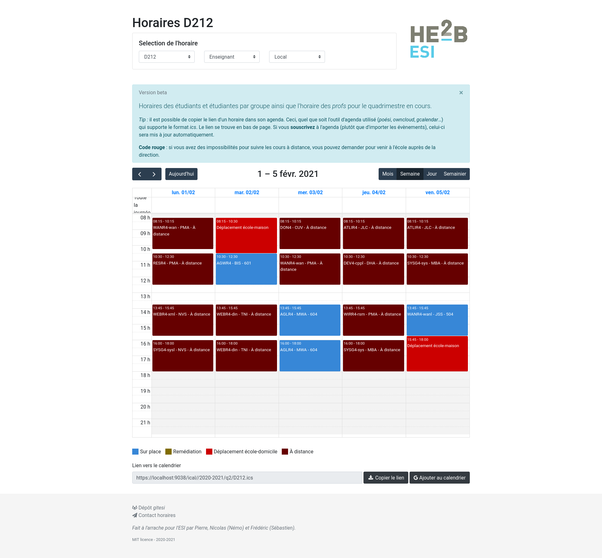

Use [Leonaard project][0] to convert iCalendar ics to [FullCalendar][1] json
using [ical.js][2] and adapt for display students and teachers timetables. 

# Demo 

Timetables are visible at http://horaires.esi-bru.be

# Contribute

Pull requests and issues are welcome. 

# Contributors

Pierre Bettens *pbt*  
Nicolas Richard *nri*  
Frédéric Servais *srv*

*Fait à l'arrache par Pierre, Nicolas-Némo et Frédéric-Sébastien.*

[0]: https://github.com/leonaard/icalendar2fullcalendar
[1]: http://fullcalendar.io/
[2]: https://mozilla-comm.github.io/ical.js/
