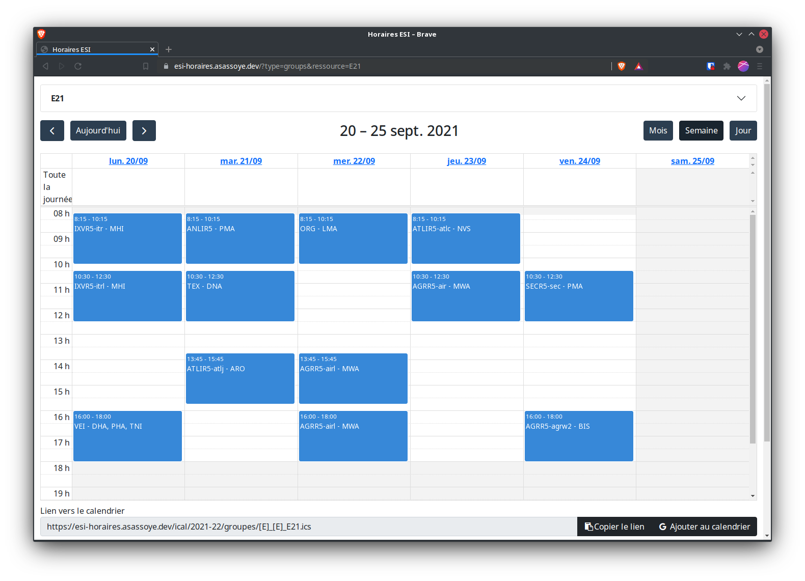

# Display timetable

Use [FullCalendar][1] to display students and teachers timetables[^1].



# Demo

Timetables are visible at https://horaires.esi-bru.be

# Compile and serve

To install all the dependencies:

```bash
$ yarn
```

To compile (the compiled files are in the `./dist` directory)

```bash
$ yarn build # Production
$ yarn dev # Development
$ yarn watch # Dev + watch for changes
```

To serve locally

```bash
$ yarn serve
```

# Contribute

Pull requests and issues are welcome.

To test locally (using `webpack devServer`) :

- Clone the repo if you haven't done so already

- Grab a copy of the current schedule by downloading the `ical/` directory from [github][5]. A zip file is available
  via [downgit][4] ; simply unzip it here in the repository.

- Create or modify `src/config/calendar.json` to point to the new calendars (cf. the README in the config folder)

- Compile the source code

- `yarn serve` launches a local webserver, using the local schedule.

- Before commit, please verify if you respect the linting by executing the command `yarn lint`.

# Contributors

- Pierre Bettens *pbt*
- Nicolas Richard *nri*
- Frédéric Servais *srv*
- Andrew Sassoye

*v1 « À l'arrache » par Pierre, Nicolas (Némo) et Frédéric (Sébastien)*  
*v2 « Marie revisitée » par Andrews*

[^1]: We used to use [Leonaard project][0] (dead link) together with [ical.js][2] to convert iCalendar (ics) to JSON.
Nowadays FullCalendar fully supports ics as a [Event Source][3] (still using ical.js).

[0]: https://github.com/leonaard/icalendar2fullcalendar

[1]: http://fullcalendar.io/

[2]: https://mozilla-comm.github.io/ical.js/

[3]: https://fullcalendar.io/docs/icalendar

[4]: https://downgit.github.io/#/home?url=https://github.com/HEB-ESI/heb-esi.github.io/tree/gh-pages/ical

[5]: https://github.com/HEB-ESI/heb-esi.github.io/tree/gh-pages/ical  
